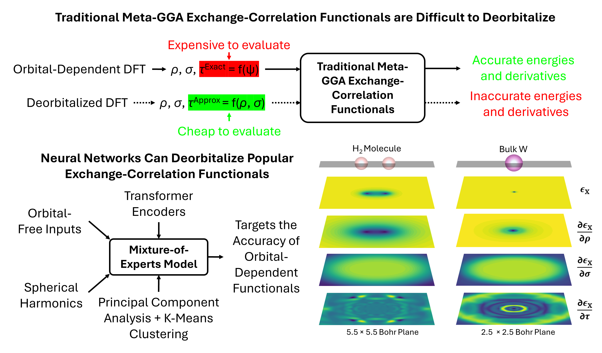

  <h1 align="center">Learning meta-GGA functionals with transformers</h1>

  <ul style="list-style-position: inside; text-align: center; padding: 0; margin: 10px 0;">
    <li style="margin-bottom: 8px;">
      This repository contains research code for the project (in preparation): 
      <strong>Mixture-of-experts transformers for faithfully deorbitalized meta-GGA density functionals</strong>
    </li>
    <li>
      All additional data (datasets, training scripts, etc.) has been uploaded to Figshare at the DOI:
    </li>
  </ul>

  <h2 align="center" style="margin-top: 10px; color: #333;">
  Overview
  </h2>
  

    
     
    <em>Summary of the physics-informed deep learning approach for reparameterizing exchange-correlation enhancement factors. The goal is to construct a surrogate model that mimics a faithfully deorbitalized meta-GGA functional, i.e., accurately predicting exchange-correlation energy densities and partial derivatives across real-space integration grids, whilst using only orbital-free input features.</em>
  

<h2 align="center" style="margin-top: 10px; color: #333;">
  Requirements
</h2>

  Pylibxc version 7.0.0: installed via 
  <code>conda install -c conda-forge pylibxc</code>

<h2 align="center" style="margin-top: 10px; color: #333;">
  Data Generation
</h2>

  Pylibxc version 7.0.0: installed via 
  <code>conda install -c conda-forge pylibxc</code>

<h2 align="center" style="margin-top: 10px; color: #333;">
  Inferencing Mixture-of-Experts Model
</h2>

  Pylibxc version 7.0.0: installed via 
  <code>conda install -c conda-forge pylibxc</code>

  

